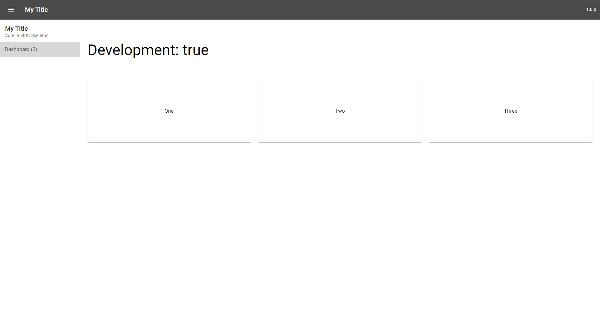

# Readme

This repository contains a Aurelia Material application with a drawer and one sub navigation item.



## Build

### Development mode
* Injects the `services/config-dev.ts` config
* Starts hot reloading development server
```bash
npm start
```

### Build release
* Injects the `services/config-prod.ts` config
* Generates the application into `dist`
```bash
npm run build
```

## Utils

### Analyze package sizes
Generates visualization of package sizes
```bash
npm run analyze
```

### Update aurelia-mdc

```shell
npm install -g npm-check-updates
ncu -u "/aurelia-mdc-web/"
npm install
```

## References

- Material Framework: https://github.com/aurelia-ui-toolkits/aurelia-mdc-web
